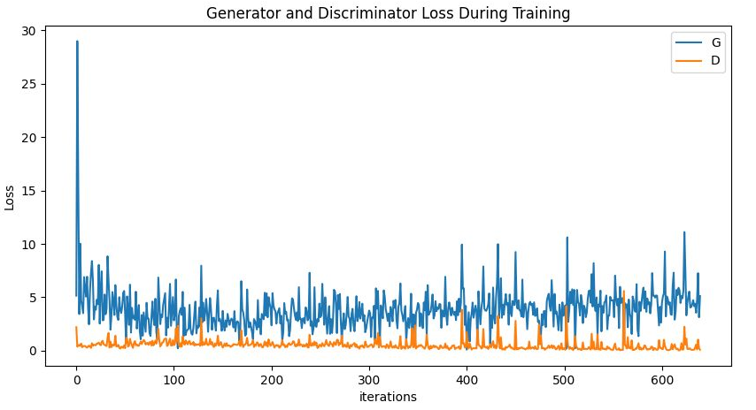

# DCGAN
Deep Convolutional GAN code and description

## Paper
[https://arxiv.org/pdf/1406.2661.pdf](https://arxiv.org/pdf/1511.06434.pdf)

<br/>

## Application technology
```
Python  
GAN(Generative Adversarial Nets)
CNN(Convolutional Neural Network)
Pytorch  
```

<br/>

## Dataset
```
/path/to/celeba
    -> img_align_celeba
        -> 188242.jpg
        -> 173822.jpg
        -> 284702.jpg
        -> 537394.jpg
           ...
```
http://mmlab.ie.cuhk.edu.hk/projects/CelebA.html
<br/>
https://drive.google.com/drive/folders/0B7EVK8r0v71pTUZsaXdaSnZBZzg?resourcekey=0-rJlzl934LzC-Xp28GeIBzQ


<br/>

## Result

 
Training images

<br/>
<br/>

 
Generator and Discriminator loss

<br/>
<br/>

 
Real and Fake images
